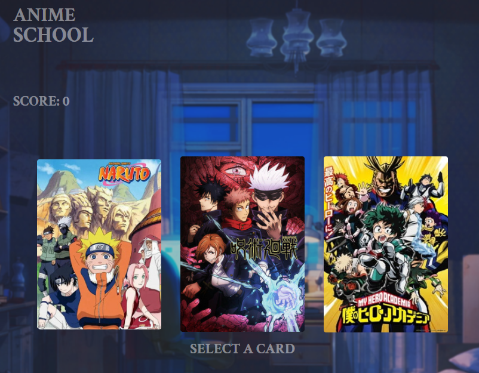

# Anime Memory Card Game

---

Memory Card Game made for The Odin Project using ReactJS. You may try it live [here](https://dwarjie.github.io/memory-card-game/)

## Installation

```bash
git clone https://github.com/dwarjie/memory-card-game.git
cd memory-card-game
npm install
npm run dev
```

## Run the test

```bash
npm run test
```

## Features

- Score System
- Random Cards
- Card Animations
- Saving of Highest Score

## What I use for creating the application

- ReactJS
- Vite
- React Router
- TailwindCSS

## What I use for testing the application

- Vitest
- React-testing-library
